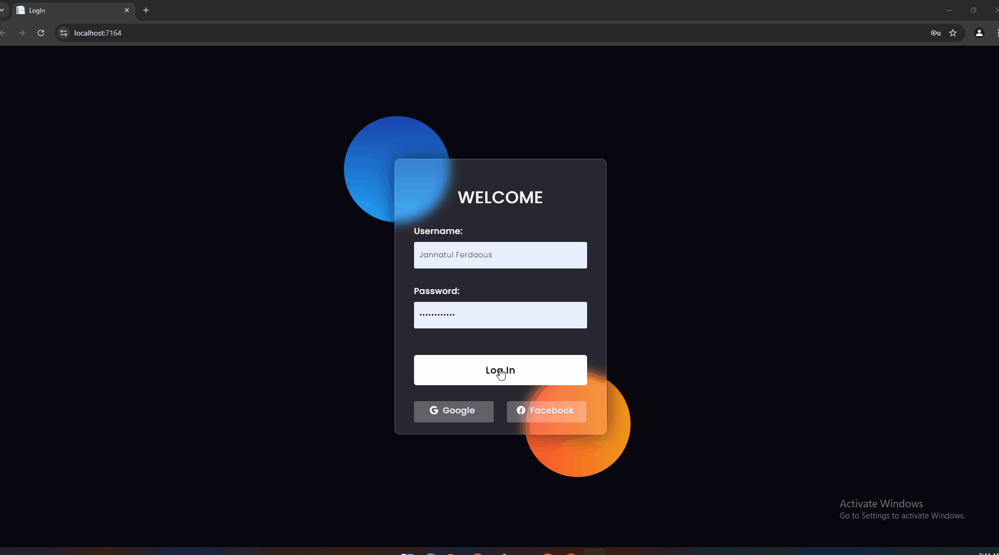

# Quiz Game Project

## Project Overview  
An interactive quiz game designed to help users learn programming languages by solving coding challenges and fixing bugs. This project implements **REST APIs** for real-time data management and features a progress-tracking system for users to monitor their improvements.

## Technologies Used  
- **Backend**: ASP.NET MVC, Web API  
- **Frontend**: HTML5, CSS, Bootstrap  
- **Database**: SQL Server  
- **ORM**: Entity Framework, LINQ  
- **Languages**: C#, HTML, CSS, JavaScript  

## Key Features  
- Players solve programming challenges and fix code bugs in real-time.
- **REST APIs** enable real-time communication between the frontend and backend.
- **Progress tracking** feature to allow users to monitor their improvements.
- **Entity Framework** used for seamless database management.

## Setup Instructions  
To run the project locally, follow these steps:

1. **Clone the repository:**
   ```bash
   git clone [https://github.com/jannatulferdaous/AllTask.git] 

